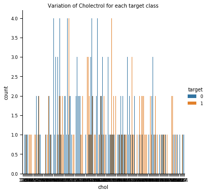

```python
import pandas as pd
import matplotlib.pyplot as plt
from sklearn.model_selection import train_test_split
from sklearn.preprocessing import StandardScaler as ss
from sklearn.svm import SVC
from sklearn.metrics import confusion_matrix
from sklearn.linear_model import LogisticRegression
from sklearn.metrics import plot_confusion_matrix
from sklearn.metrics import classification_report
from sklearn.ensemble import RandomForestClassifier
from sklearn.tree import DecisionTreeClassifier
from sklearn.linear_model import LogisticRegression
import seaborn as sns
```


```python
# import warnings filter
from warnings import simplefilter
```


```python
# ignore all future warnings
simplefilter(action='ignore', category = FutureWarning)
```


```python
# read the dataset file
df = pd.read_csv('data.csv', header = None)

df.columns = ['age', 'sex', 'cp', 'trestbps', 'chol',
              'fbs', 'restecg', 'thalach', 'exang', 
              'oldpeak', 'slope', 'ca', 'thal', 'target']
```


```python
df.head()
```


<div>
<style scoped>
    .dataframe tbody tr th:only-of-type {
        vertical-align: middle;
    }

    .dataframe tbody tr th {
        vertical-align: top;
    }

    .dataframe thead th {
        text-align: right;
    }
</style>
<table border="1" class="dataframe">
  <thead>
    <tr style="text-align: right;">
      <th></th>
      <th>age</th>
      <th>sex</th>
      <th>cp</th>
      <th>trestbps</th>
      <th>chol</th>
      <th>fbs</th>
      <th>restecg</th>
      <th>thalach</th>
      <th>exang</th>
      <th>oldpeak</th>
      <th>slope</th>
      <th>ca</th>
      <th>thal</th>
      <th>target</th>
    </tr>
  </thead>
  <tbody>
    <tr>
      <th>0</th>
      <td>63</td>
      <td>1</td>
      <td>1</td>
      <td>145</td>
      <td>233</td>
      <td>1</td>
      <td>2</td>
      <td>150</td>
      <td>0</td>
      <td>2.3</td>
      <td>3</td>
      <td>0.0</td>
      <td>6.0</td>
      <td>0</td>
    </tr>
    <tr>
      <th>1</th>
      <td>67</td>
      <td>1</td>
      <td>4</td>
      <td>160</td>
      <td>286</td>
      <td>0</td>
      <td>2</td>
      <td>108</td>
      <td>1</td>
      <td>1.5</td>
      <td>2</td>
      <td>3.0</td>
      <td>3.0</td>
      <td>2</td>
    </tr>
    <tr>
      <th>2</th>
      <td>67</td>
      <td>1</td>
      <td>4</td>
      <td>120</td>
      <td>229</td>
      <td>0</td>
      <td>2</td>
      <td>129</td>
      <td>1</td>
      <td>2.6</td>
      <td>2</td>
      <td>2.0</td>
      <td>7.0</td>
      <td>1</td>
    </tr>
    <tr>
      <th>3</th>
      <td>37</td>
      <td>1</td>
      <td>3</td>
      <td>130</td>
      <td>250</td>
      <td>0</td>
      <td>0</td>
      <td>187</td>
      <td>0</td>
      <td>3.5</td>
      <td>3</td>
      <td>0.0</td>
      <td>3.0</td>
      <td>0</td>
    </tr>
    <tr>
      <th>4</th>
      <td>41</td>
      <td>0</td>
      <td>2</td>
      <td>130</td>
      <td>204</td>
      <td>0</td>
      <td>2</td>
      <td>172</td>
      <td>0</td>
      <td>1.4</td>
      <td>1</td>
      <td>0.0</td>
      <td>3.0</td>
      <td>0</td>
    </tr>
  </tbody>
</table>
</div>


```python
### 1 = male, 0 = female
df.isnull().sum()

df['target'] = df.target.map({0: 0, 1: 1, 2: 1, 3: 1, 4: 1})
df['sex'] = df.sex.map({0: 'female', 1: 'male'})
df['thal'] = df.thal.fillna(df.thal.mean())
df['ca'] = df.ca.fillna(df.ca.mean())
df['sex'] = df.sex.map({'female': 0, 'male': 1})
```


```python
################################## Plots

# distribution of target vs age 
sns.set_context("paper", font_scale = 1, rc = {"font.size": 10,"axes.titlesize": 10,"axes.labelsize": 10}) 
sns.catplot(kind = 'count', data = df, x = 'age', hue = 'target', order = df['age'].sort_values().unique())
plt.title('Variation of Age for each target class')
plt.show()
```


    

    


```python
# distribution of target vs sex 
sns.set_context("paper", font_scale = 1, rc = {"font.size": 10,"axes.titlesize": 10,"axes.labelsize": 10}) 
sns.catplot(kind = 'count', data = df, x = 'sex', hue = 'target', order = df['sex'].sort_values().unique())
plt.title('Variation gender for each target class')
plt.show()
```


    

    


```python
# distribution of target vs BP 
sns.set_context("paper", font_scale = 1, rc = {"font.size": 10,"axes.titlesize": 10,"axes.labelsize": 10}) 
sns.catplot(kind = 'count', data = df, x = 'trestbps', hue = 'target', order = df['trestbps'].sort_values().unique())
plt.title('Variation of resting blood pressure (mmHg) for each target class')
plt.show()
```


    

    


```python
# distribution of target vs Chol 
sns.set_context("paper", font_scale = 1, rc = {"font.size": 10,"axes.titlesize": 10,"axes.labelsize": 10}) 
sns.catplot(kind = 'count', data = df, x = 'chol', hue = 'target', order = df['chol'].sort_values().unique())
plt.title('Variation of Cholectrol for each target class')
plt.show()
```


    

    


```python
# distribution of target vs thalach 
sns.set_context("paper", font_scale = 1, rc = {"font.size": 10,"axes.titlesize": 10,"axes.labelsize": 10}) 
sns.catplot(kind = 'count', data = df, x = 'thalach', hue = 'target', order = df['thalach'].sort_values().unique())
plt.title('Variation of maximum heart rate achieved for each target class')
plt.show()
```


    

    


```python
#trestbps
#chol
#Thalach


################################## data assignment
X = df.iloc[:, :-1].values
y = df.iloc[:, -1].values

X_train, X_test, y_train, y_test = train_test_split(X, y, test_size = 0.2, random_state = 0)
sc = ss()
X_train = sc.fit_transform(X_train)
X_test = sc.transform(X_test)
```


```python
#########################################   SVM   #############################################################

classifier = SVC(kernel = 'rbf')
classifier.fit(X_train, y_train)

```


    SVC(C=1.0, break_ties=False, cache_size=200, class_weight=None, coef0=0.0,
        decision_function_shape='ovr', degree=3, gamma='scale', kernel='rbf',
        max_iter=-1, probability=False, random_state=None, shrinking=True,
        tol=0.001, verbose=False)


```python
# Predicting the Test set results
y_pred = classifier.predict(X_test)
```


```python
cm_test = confusion_matrix(y_pred, y_test)

```


```python
y_pred_train = classifier.predict(X_train)
cm_train = confusion_matrix(y_pred_train, y_train)

print()
print('Accuracy for training set for svm = {}'.format((cm_train[0][0] + cm_train[1][1])/len(y_train)))
print('Accuracy for test set for svm = {}'.format((cm_test[0][0] + cm_test[1][1])/len(y_test)))
```

    
    Accuracy for training set for svm = 0.9256198347107438
    Accuracy for test set for svm = 0.8032786885245902
    


```python
plot_confusion_matrix(classifier, X_test, y_test)  
plt.title("SVM confusion matrix")
plt.show()
```


    

    


```python
matrix = confusion_matrix(y_train,y_pred_train, labels=[1,0])
print('Confusion matrix SVM: \n',matrix)
```

    Confusion matrix SVM: 
     [[100  13]
     [  5 124]]
    


```python
# classification report for precision, recall f1-score and accuracy
matrix = classification_report(y_train,y_pred_train,labels=[1,0])
print('Classification report SVM : \n',matrix)
```

    Classification report SVM : 
                   precision    recall  f1-score   support
    
               1       0.95      0.88      0.92       113
               0       0.91      0.96      0.93       129
    
        accuracy                           0.93       242
       macro avg       0.93      0.92      0.92       242
    weighted avg       0.93      0.93      0.93       242
    
    


```python
#########################################   Logistic Regression  #############################################################

X = df.iloc[:, :-1].values
y = df.iloc[:, -1].values

X_train, X_test, y_train, y_test = train_test_split(X, y, test_size = 0.2, random_state = 0)

classifier = LogisticRegression()
classifier.fit(X_train, y_train)
```

    /opt/anaconda3/lib/python3.7/site-packages/sklearn/linear_model/_logistic.py:940: ConvergenceWarning: lbfgs failed to converge (status=1):
    STOP: TOTAL NO. of ITERATIONS REACHED LIMIT.
    
    Increase the number of iterations (max_iter) or scale the data as shown in:
        https://scikit-learn.org/stable/modules/preprocessing.html
    Please also refer to the documentation for alternative solver options:
        https://scikit-learn.org/stable/modules/linear_model.html#logistic-regression
      extra_warning_msg=_LOGISTIC_SOLVER_CONVERGENCE_MSG)
    


    LogisticRegression(C=1.0, class_weight=None, dual=False, fit_intercept=True,
                       intercept_scaling=1, l1_ratio=None, max_iter=100,
                       multi_class='auto', n_jobs=None, penalty='l2',
                       random_state=None, solver='lbfgs', tol=0.0001, verbose=0,
                       warm_start=False)


```python
# Predicting the Test set results
y_pred = classifier.predict(X_test)
```


```python
from sklearn.metrics import confusion_matrix
cm_test = confusion_matrix(y_pred, y_test)

y_pred_train = classifier.predict(X_train)
cm_train = confusion_matrix(y_pred_train, y_train)

print()
print('Accuracy for training set for Logistic Regression = {}'.format((cm_train[0][0] + cm_train[1][1])/len(y_train)))
print('Accuracy for test set for Logistic Regression = {}'.format((cm_test[0][0] + cm_test[1][1])/len(y_test)))
```

    
    Accuracy for training set for Logistic Regression = 0.8636363636363636
    Accuracy for test set for Logistic Regression = 0.8032786885245902
    


```python
plot_confusion_matrix(classifier, X_test, y_test)  
plt.title("Logistic Regression confusion matrix")
plt.show()
```


    

    


```python
matrix = confusion_matrix(y_train,y_pred_train, labels=[1,0])
print('Confusion matrix Logistic Regression: \n',matrix)
```

    Confusion matrix Logistic Regression: 
     [[ 91  22]
     [ 11 118]]
    


```python
# classification report for precision, recall f1-score and accuracy
matrix = classification_report(y_train,y_pred_train,labels=[1,0])
print('Classification report Logistic Regression: \n',matrix)
```

    Classification report Logistic Regression: 
                   precision    recall  f1-score   support
    
               1       0.89      0.81      0.85       113
               0       0.84      0.91      0.88       129
    
        accuracy                           0.86       242
       macro avg       0.87      0.86      0.86       242
    weighted avg       0.87      0.86      0.86       242
    
    


```python
#########################################   Decision Tree  #############################################################

X = df.iloc[:, :-1].values
y = df.iloc[:, -1].values

X_train, X_test, y_train, y_test = train_test_split(X, y, test_size = 0.2, random_state = 0)

classifier = DecisionTreeClassifier()
classifier.fit(X_train, y_train)
```


    DecisionTreeClassifier(ccp_alpha=0.0, class_weight=None, criterion='gini',
                           max_depth=None, max_features=None, max_leaf_nodes=None,
                           min_impurity_decrease=0.0, min_impurity_split=None,
                           min_samples_leaf=1, min_samples_split=2,
                           min_weight_fraction_leaf=0.0, presort='deprecated',
                           random_state=None, splitter='best')


```python
# Predicting the Test set results
y_pred = classifier.predict(X_test)

from sklearn.metrics import confusion_matrix
cm_test = confusion_matrix(y_pred, y_test)

y_pred_train = classifier.predict(X_train)
cm_train = confusion_matrix(y_pred_train, y_train)

print()
print('Accuracy for training set for Decision Tree = {}'.format((cm_train[0][0] + cm_train[1][1])/len(y_train)))
print('Accuracy for test set for Decision Tree = {}'.format((cm_test[0][0] + cm_test[1][1])/len(y_test)))
```

    
    Accuracy for training set for Decision Tree = 1.0
    Accuracy for test set for Decision Tree = 0.7540983606557377
    


```python
plot_confusion_matrix(classifier, X_test, y_test)  
plt.title("Decision Tree confusion matrix")
plt.show()
```


    

    


```python
matrix = confusion_matrix(y_train,y_pred_train, labels=[1,0])
print('Confusion matrix Decision Tree: \n',matrix)
```

    Confusion matrix Decision Tree: 
     [[113   0]
     [  0 129]]
    


```python
# classification report for precision, recall f1-score and accuracy
matrix = classification_report(y_train,y_pred_train,labels=[1,0])
print('Classification report Decision Tree: \n',matrix)
```

    Classification report Decision Tree: 
                   precision    recall  f1-score   support
    
               1       1.00      1.00      1.00       113
               0       1.00      1.00      1.00       129
    
        accuracy                           1.00       242
       macro avg       1.00      1.00      1.00       242
    weighted avg       1.00      1.00      1.00       242
    
    


```python
#########################################  Random Forest  #############################################################
X = df.iloc[:, :-1].values
y = df.iloc[:, -1].values

X_train, X_test, y_train, y_test = train_test_split(X, y, test_size = 0.2, random_state = 0)

classifier = RandomForestClassifier(n_estimators = 10)
classifier.fit(X_train, y_train)
```


    RandomForestClassifier(bootstrap=True, ccp_alpha=0.0, class_weight=None,
                           criterion='gini', max_depth=None, max_features='auto',
                           max_leaf_nodes=None, max_samples=None,
                           min_impurity_decrease=0.0, min_impurity_split=None,
                           min_samples_leaf=1, min_samples_split=2,
                           min_weight_fraction_leaf=0.0, n_estimators=10,
                           n_jobs=None, oob_score=False, random_state=None,
                           verbose=0, warm_start=False)


```python
# Predicting the Test set results
y_pred = classifier.predict(X_test)

from sklearn.metrics import confusion_matrix
cm_test = confusion_matrix(y_pred, y_test)

y_pred_train = classifier.predict(X_train)
cm_train = confusion_matrix(y_pred_train, y_train)

print()
print('Accuracy for training set for Random Forest = {}'.format((cm_train[0][0] + cm_train[1][1])/len(y_train)))
print('Accuracy for test set for Random Forest = {}'.format((cm_test[0][0] + cm_test[1][1])/len(y_test)))

```

    
    Accuracy for training set for Random Forest = 0.9958677685950413
    Accuracy for test set for Random Forest = 0.8032786885245902
    


```python
plot_confusion_matrix(classifier, X_test, y_test)  
plt.title("Random Forest confusion matrix")
plt.show()
```


    

    


```python
# classification report for precision, recall f1-score and accuracy
matrix = classification_report(y_train,y_pred_train,labels=[1,0])
print('Classification report Random Forest: \n',matrix)
```

    Classification report Random Forest: 
                   precision    recall  f1-score   support
    
               1       0.99      1.00      1.00       113
               0       1.00      0.99      1.00       129
    
        accuracy                           1.00       242
       macro avg       1.00      1.00      1.00       242
    weighted avg       1.00      1.00      1.00       242
    
    


```python
import pandas as pd
import matplotlib.pyplot as plt
```


```python
def Support_fun(commonVal,firstIDX,secondIDX):
    support = (len(commonVal)/(len(firstIDX)+len(secondIDX)))
    return support 

def Confidence_fun(commonVal,firstIDX):
    confidence = (len(commonVal)/len(firstIDX))
    return confidence

def Lift_fun(commonVal,firstIDX,secondIDX):
    lift = ((len(commonVal)/(len(firstIDX))/(len(secondIDX)/100)))
    return lift 
```


```python
data_set = pd.read_csv('data.csv', header = None)

# Add columns names
data_set.columns = ['age', 'sex', 'cp', 'trestbps', 'chol',
              'fbs', 'restecg', 'thalach', 'exang', 
              'oldpeak', 'slope', 'ca', 'thal', 'target']

# ###  separate the data_set two varibles
# target==1 class
target_class_1 = data_set[(data_set['target']==1) | (data_set['target']==2)|(data_set['target']==3) | (data_set['target']==5)]

```


```python
# cp index values in target_calss_1 dataset
cp = target_class_1[target_class_1['cp']!=3]
cp = cp.iloc[:,:0]
cp.reset_index(inplace=True)

# cp index values in target_calss_1 dataset
trestbps = target_class_1[target_class_1['trestbps']>120]
trestbps = trestbps.iloc[:,:0]
trestbps.reset_index(inplace = True)

# chol index values in target_calss_1 dataset
chol = target_class_1[target_class_1['chol']>200]
chol = chol.iloc[:,:0]
chol.reset_index(inplace = True)

# fbs index values in target_calss_1 dataset
fbs = target_class_1[target_class_1['fbs']==1]
fbs = fbs.iloc[:,:0]
fbs.reset_index(inplace = True)

# thalach index values in target_calss_1 dataset
thalach=target_class_1[target_class_1['thalach']>100]
thalach=thalach.iloc[:,:0]
thalach.reset_index(inplace=True)

# restecg index values in target_calss_1 dataset
restecg=target_class_1[target_class_1['restecg']!=0]
restecg=restecg.iloc[:,:0]
restecg.reset_index(inplace=True)

# exang index values in target_calss_1 dataset
exang = target_class_1[target_class_1['exang']==1]
exang = exang.iloc[:,:0]
exang.reset_index(inplace  =True)

# ca index values in target_calss_1 dataset
ca=target_class_1[target_class_1['ca']>0]
ca=ca.iloc[:,:0]
ca.reset_index(inplace=True)

# thal index values in target_calss_1 dataset
thal=target_class_1[target_class_1['thal']!=3]
thal=thal.iloc[:,:0]
thal.reset_index(inplace=True)
```


```python
#  3. common values in cp and other attributes
cpValue1 = pd.merge(cp,trestbps)
cpValue2 = pd.merge(cp,chol)
cpValue3 = pd.merge(cp,fbs)
cpValue4 = pd.merge(cp,restecg)
cpValue5 = pd.merge(cp,thalach)
cpValue6 = pd.merge(cp,exang)
cpValue7 = pd.merge(cp,ca)
cpValue8 = pd.merge(cp,thal)

```


```python
support1 = Support_fun(cpValue1,cp,trestbps)
support2 = Support_fun(cpValue2,cp,chol)
support3 = Support_fun(cpValue3,cp,fbs)
support4 = Support_fun(cpValue4,cp,restecg)
support5 = Support_fun(cpValue5,cp,thalach)
support6 = Support_fun(cpValue6,cp,exang)
support7 = Support_fun(cpValue7,cp,ca)
support8 = Support_fun(cpValue7,cp,thal)

support_cp = [support1, support2, support3, support4, support5, support6, support7, support8]
#print(support_cp)

c= ['red', 'green', 'blue', 'magenta', 'yellow', 'cyan', 'black', 'pink']
x_axis = ["trestbps", "chol", 'fbs', 'restecg', 'thalach', 'exang', 'ca', 'thal']
plt.bar(x_axis,support_cp, color=c)
plt.title('Abnormal Association between cp and other parameters')
plt.show()
```


    

    


```python
confidence1 = Confidence_fun(cpValue1,cp)
confidence2 = Confidence_fun(cpValue2,cp)
confidence3 = Confidence_fun(cpValue3,cp)
confidence4 = Confidence_fun(cpValue4,cp)
confidence5 = Confidence_fun(cpValue5,cp)
confidence6 = Confidence_fun(cpValue6,cp)
confidence7 = Confidence_fun(cpValue7,cp)
confidence8 = Confidence_fun(cpValue8,cp)

confidence_cp  = [confidence1, confidence2, confidence3, confidence4, confidence5, confidence6, confidence7, confidence8]
#print(confidence_cp)

plt.bar(x_axis,confidence_cp, color=c)
plt.title('Abnormal Association between cp and other parameters')
plt.show()
```


    

    


```python
# 4. common values in trestbps and other attributes
trestbpsValue1 = pd.merge(trestbps,cp)
trestbpsValue2 = pd.merge(trestbps,chol)
trestbpsValue3 = pd.merge(trestbps,fbs)
trestbpsValue4 = pd.merge(trestbps,restecg)
trestbpsValue5 = pd.merge(trestbps,thalach)
trestbpsValue6 = pd.merge(trestbps,exang)
trestbpsValue7 = pd.merge(trestbps,ca)
trestbpsValue8 = pd.merge(trestbps,thal)
```


```python
support1 = Support_fun(trestbpsValue1,trestbps,cp)
support2 = Support_fun(trestbpsValue2,trestbps,chol)
support3 = Support_fun(trestbpsValue3,trestbps,fbs)
support4 = Support_fun(trestbpsValue4,trestbps,restecg)
support5 = Support_fun(trestbpsValue5,trestbps,thalach)
support6 = Support_fun(trestbpsValue6,trestbps,exang)
support7 = Support_fun(trestbpsValue7,trestbps,ca)
support8 = Support_fun(trestbpsValue7,trestbps,thal)

support_trestbps = [support1, support2, support3, support4, support5, support6, support7, support8]
#print(support_trestbps)
x_axis = ["cp", "chol", 'fbs', 'restecg', 'thalach', 'exang', 'ca', 'thal']
plt.bar(x_axis,support_trestbps, color=c)
plt.title('Abnormal Association between trestbps and other parameters')
plt.show()
```


    

    


```python
confidence1 = Confidence_fun(trestbpsValue1,trestbps)
confidence2 = Confidence_fun(trestbpsValue2,trestbps)
confidence3 = Confidence_fun(trestbpsValue3,trestbps)
confidence4 = Confidence_fun(trestbpsValue4,trestbps)
confidence5 = Confidence_fun(trestbpsValue5,trestbps)
confidence6 = Confidence_fun(trestbpsValue6,trestbps)
confidence7 = Confidence_fun(trestbpsValue7,trestbps)
confidence8 = Confidence_fun(trestbpsValue8,trestbps)

confidence_trestbps  = [confidence1, confidence2, confidence3, confidence4, confidence5, confidence6, confidence7, confidence8]
#print(confidence_trestbps)
plt.bar(x_axis,confidence_trestbps, color=c)
plt.title('Abnormal Association between trestbps and other parameters')
plt.show()
```


    

    


```python
# 5. common values in chol and other attributes
cholValue1 = pd.merge(chol,cp)
cholValue2 = pd.merge(chol,trestbps)
cholValue3 = pd.merge(chol,fbs)
cholValue4 = pd.merge(chol,restecg)
cholValue5 = pd.merge(chol,thalach)
cholValue6 = pd.merge(chol,exang)
cholValue7 = pd.merge(chol,ca)
cholValue8 = pd.merge(chol,thal)
```


```python
support1 = Support_fun(cholValue1,chol,cp)
support2 = Support_fun(cholValue2,chol,trestbps)
support3 = Support_fun(cholValue3,chol,fbs)
support4 = Support_fun(cholValue4,chol,restecg)
support5 = Support_fun(cholValue5,chol,thalach)
support6 = Support_fun(cholValue6,chol,exang)
support7 = Support_fun(cholValue7,chol,ca)
support8 = Support_fun(cholValue7,chol,thal)

support_chol = [support1, support2, support3, support4, support5, support6, support7, support8]
#print(support_chol)
x_axis = ["cp", "trestbps", 'fbs', 'restecg', 'thalach', 'exang', 'ca', 'thal']
plt.bar(x_axis,support_trestbps, color=c)
plt.title('Abnormal Association between chol and other parameters')
plt.show()
```


    

    


```python
confidence1 = Confidence_fun(cholValue1,chol)
confidence2 = Confidence_fun(cholValue2,chol)
confidence3 = Confidence_fun(cholValue3,chol)
confidence4 = Confidence_fun(cholValue4,chol)
confidence5 = Confidence_fun(cholValue5,chol)
confidence6 = Confidence_fun(cholValue6,chol)
confidence7 = Confidence_fun(cholValue7,chol)
confidence8 = Confidence_fun(cholValue8,chol)

confidence_chol  = [confidence1, confidence2, confidence3, confidence4, confidence5, confidence6, confidence7, confidence8]
#print(confidence_chol)
plt.bar(x_axis,support_chol, color=c)
plt.title('Abnormal Association between chol and other parameters')
plt.show()
```


    

    


```python
# 6. common values in fbs and other attributes
fbsValue1 = pd.merge(fbs,cp)
fbsValue2 = pd.merge(fbs,trestbps)
fbsValue3 = pd.merge(fbs,chol)
fbsValue4 = pd.merge(fbs,restecg)
fbsValue5 = pd.merge(fbs,thalach)
fbsValue6 = pd.merge(fbs,exang)
fbsValue7 = pd.merge(fbs,ca)
fbsValue8 = pd.merge(fbs,thal)
```


```python
support1 = Support_fun(fbsValue1,fbs,cp)
support2 = Support_fun(fbsValue2,fbs,trestbps)
support3 = Support_fun(fbsValue3,fbs,chol)
support4 = Support_fun(fbsValue4,fbs,restecg)
support5 = Support_fun(fbsValue5,fbs,thalach)
support6 = Support_fun(fbsValue6,fbs,exang)
support7 = Support_fun(fbsValue7,fbs,ca)
support8 = Support_fun(fbsValue7,fbs,thal)

support_fbs = [support1, support2, support3, support4, support5, support6, support7, support8]
#print(support_fbs)
x_axis = ["cp", "trestbps", 'chol', 'restecg', 'thalach', 'exang', 'ca', 'thal']
plt.bar(x_axis,support_fbs, color=c)
plt.title('Abnormal Association between fbs and other parameters')
plt.show()
```


    

    


```python
confidence1 = Confidence_fun(fbsValue1,fbs)
confidence2 = Confidence_fun(fbsValue2,fbs)
confidence3 = Confidence_fun(fbsValue3,fbs)
confidence4 = Confidence_fun(fbsValue4,fbs)
confidence5 = Confidence_fun(fbsValue5,fbs)
confidence6 = Confidence_fun(fbsValue6,fbs)
confidence7 = Confidence_fun(fbsValue7,fbs)
confidence8 = Confidence_fun(fbsValue8,fbs)

confidence_fbs  = [confidence1, confidence2, confidence3, confidence4, confidence5, confidence6, confidence7, confidence8]
#print(confidence_fbs)
plt.bar(x_axis,confidence_fbs, color=c)
plt.title('Abnormal Association between fbs and other parameters')
plt.show()
```


    

    


```python
# 7. common values in restecg and other attributes
restecgValue1 = pd.merge(restecg,cp)
restecgValue2 = pd.merge(restecg,trestbps)
restecgValue3 = pd.merge(restecg,chol)
restecgValue4 = pd.merge(restecg,fbs)
restecgValue5 = pd.merge(restecg,thalach)
restecgValue6 = pd.merge(restecg,exang)
restecgValue7 = pd.merge(restecg,ca)
restecgValue8 = pd.merge(restecg,thal)
```


```python
support1 = Support_fun(restecgValue1,restecg,cp)
support2 = Support_fun(restecgValue2,restecg,trestbps)
support3 = Support_fun(restecgValue3,restecg,chol)
support4 = Support_fun(restecgValue4,restecg,fbs)
support5 = Support_fun(restecgValue5,restecg,thalach)
support6 = Support_fun(restecgValue6,restecg,exang)
support7 = Support_fun(restecgValue7,restecg,ca)
support8 = Support_fun(restecgValue7,restecg,thal)

support_restecg = [support1, support2, support3, support4, support5, support6, support7, support8]
#print(support_restecg)
x_axis = ["cp", "trestbps", 'chol', 'fbs', 'thalach', 'exang', 'ca', 'thal']
plt.bar(x_axis,support_restecg, color=c)
plt.title('Abnormal Association between restecg and other parameters')
plt.show()
```


    

    


```python
confidence1 = Confidence_fun(restecgValue1,restecg)
confidence2 = Confidence_fun(restecgValue2,restecg)
confidence3 = Confidence_fun(restecgValue3,restecg)
confidence4 = Confidence_fun(restecgValue4,restecg)
confidence5 = Confidence_fun(restecgValue5,restecg)
confidence6 = Confidence_fun(restecgValue6,restecg)
confidence7 = Confidence_fun(restecgValue7,restecg)
confidence8 = Confidence_fun(restecgValue8,restecg)

confidence_restecg  = [confidence1, confidence2, confidence3, confidence4, confidence5, confidence6, confidence7, confidence8]
#print(confidence_restecg)
plt.bar(x_axis,confidence_restecg, color=c)
plt.title('Abnormal Association between restecg and other parameters')
plt.show()
```


    

    


```python
# 8. common values in thalach and other attributes
thalachValue1 = pd.merge(thalach,cp)
thalachValue2 = pd.merge(thalach,trestbps)
thalachValue3 = pd.merge(thalach,chol)
thalachValue4 = pd.merge(thalach,fbs)
thalachValue5 = pd.merge(thalach,restecg)
thalachValue6 = pd.merge(thalach,exang)
thalachValue7 = pd.merge(thalach,ca)
thalachValue8 = pd.merge(thalach,thal)
```


```python
support1 = Support_fun(thalachValue1,thalach,cp)
support2 = Support_fun(thalachValue2,thalach,trestbps)
support3 = Support_fun(thalachValue3,thalach,chol)
support4 = Support_fun(thalachValue4,thalach,fbs)
support5 = Support_fun(thalachValue5,thalach,restecg)
support6 = Support_fun(thalachValue6,thalach,exang)
support7 = Support_fun(thalachValue7,thalach,ca)
support8 = Support_fun(thalachValue7,thalach,thal)

support_thalach = [support1, support2, support3, support4, support5, support6, support7, support8]
#print(support_thalach)
x_axis = ["cp", "trestbps", 'chol', 'fbs', 'restecg', 'exang', 'ca', 'thal']
plt.bar(x_axis,support_thalach, color=c)
plt.title('Abnormal Association between thalach and other parameters')
plt.show()
```


    

    


```python
confidence1 = Confidence_fun(thalachValue1,thalach)
confidence2 = Confidence_fun(thalachValue2,thalach)
confidence3 = Confidence_fun(thalachValue3,thalach)
confidence4 = Confidence_fun(thalachValue4,thalach)
confidence5 = Confidence_fun(thalachValue5,thalach)
confidence6 = Confidence_fun(thalachValue6,thalach)
confidence7 = Confidence_fun(thalachValue7,thalach)
confidence8 = Confidence_fun(thalachValue8,thalach)

confidence_thalach  = [confidence1, confidence2, confidence3, confidence4, confidence5, confidence6, confidence7, confidence8]
#print(confidence_thalach)
plt.bar(x_axis,confidence_thalach, color=c)
plt.title('Abnormal Association between thalach and other parameters')
plt.show()
```


    

    


```python
# 9. common values in exang and other attributes
exangValue1 = pd.merge(exang,cp)
exangValue2 = pd.merge(exang,trestbps)
exangValue3 = pd.merge(exang,chol)
exangValue4 = pd.merge(exang,fbs)
exangValue5 = pd.merge(exang,restecg)
exangValue6 = pd.merge(exang,thalach)
exangValue7 = pd.merge(exang,ca)
exangValue8 = pd.merge(exang,thal)
```


```python
support1 = Support_fun(exangValue1,exang,cp)
support2 = Support_fun(exangValue2,exang,trestbps)
support3 = Support_fun(exangValue3,exang,chol)
support4 = Support_fun(exangValue4,exang,fbs)
support5 = Support_fun(exangValue5,exang,restecg)
support6 = Support_fun(exangValue6,exang,thalach)
support7 = Support_fun(exangValue7,exang,ca)
support8 = Support_fun(exangValue7,exang,thal)

support_exang = [support1, support2, support3, support4, support5, support6, support7, support8]
#print(support_exang)
x_axis = ["cp", "trestbps", 'chol', 'fbs', 'restecg', 'thalach', 'ca', 'thal']
plt.bar(x_axis,support_exang, color=c)
plt.title('Abnormal Association between exang and other parameters')
plt.show()
```


    

    


```python
confidence1 = Confidence_fun(exangValue1,exang)
confidence2 = Confidence_fun(exangValue2,exang)
confidence3 = Confidence_fun(exangValue3,exang)
confidence4 = Confidence_fun(exangValue4,exang)
confidence5 = Confidence_fun(exangValue5,exang)
confidence6 = Confidence_fun(exangValue6,exang)
confidence7 = Confidence_fun(exangValue7,exang)
confidence8 = Confidence_fun(exangValue8,exang)

confidence_exang  = [confidence1, confidence2, confidence3, confidence4, confidence5, confidence6, confidence7, confidence8]
#print(confidence_exang)
plt.bar(x_axis,confidence_exang, color=c)
plt.title('Abnormal Association between exang and other parameters')
plt.show()
```


    

    


```python
# 12. common values in ca and other attributes
caValue1 = pd.merge(ca,cp)
caValue2 = pd.merge(ca,trestbps)
caValue3 = pd.merge(ca,chol)
caValue4 = pd.merge(ca,fbs)
caValue5 = pd.merge(ca,restecg)
caValue6 = pd.merge(ca,thalach)
caValue7 = pd.merge(ca,exang)
caValue8 = pd.merge(ca,thal)
```


```python
support1 = Support_fun(caValue1,ca,cp)
support2 = Support_fun(caValue2,ca,trestbps)
support3 = Support_fun(caValue3,ca,chol)
support4 = Support_fun(caValue4,ca,fbs)
support5 = Support_fun(caValue5,ca,restecg)
support6 = Support_fun(caValue6,ca,thalach)
support7 = Support_fun(caValue7,ca,exang)
support8 = Support_fun(caValue7,ca,thal)

support_ca = [support1, support2, support3, support4, support5, support6, support7, support8]
#print(support_ca)
x_axis = ["cp", "trestbps", 'chol', 'fbs', 'restecg', 'thalach', 'exang', 'thal']
plt.bar(x_axis,support_ca, color=c)
plt.title('Abnormal Association between ca and other parameters')
plt.show()
```


    

    


```python
confidence1 = Confidence_fun(caValue1,ca)
confidence2 = Confidence_fun(caValue2,ca)
confidence3 = Confidence_fun(caValue3,ca)
confidence4 = Confidence_fun(caValue4,ca)
confidence5 = Confidence_fun(caValue5,ca)
confidence6 = Confidence_fun(caValue6,ca)
confidence7 = Confidence_fun(caValue7,ca)
confidence8 = Confidence_fun(caValue8,ca)

confidence_ca  = [confidence1, confidence2, confidence3, confidence4, confidence5, confidence6, confidence7, confidence8]
#print(confidence_ca)
plt.bar(x_axis,confidence_ca, color=c)
plt.title('Abnormal Association between ca and other parameters')
plt.show()
```


    

    


```python
# 13. common values in thal and other attributes
thalValue1 = pd.merge(thal,cp)
thalValue2 = pd.merge(thal,trestbps)
thalValue3 = pd.merge(thal,chol)
thalValue4 = pd.merge(thal,fbs)
thalValue5 = pd.merge(thal,restecg)
thalValue6 = pd.merge(thal,thalach)
thalValue7 = pd.merge(thal,exang)
thalValue8 = pd.merge(thal,ca)
```


```python
support1 = Support_fun(thalValue1,thal,cp)
support2 = Support_fun(thalValue2,thal,trestbps)
support3 = Support_fun(thalValue3,thal,chol)
support4 = Support_fun(thalValue4,thal,fbs)
support5 = Support_fun(thalValue5,thal,restecg)
support6 = Support_fun(thalValue6,thal,thalach)
support7 = Support_fun(thalValue7,thal,exang)
support8 = Support_fun(thalValue7,thal,ca)

support_thal = [support1, support2, support3, support4, support5, support6, support7, support8]
#print(support_thal)
x_axis = ["cp", "trestbps", 'chol', 'fbs', 'restecg', 'thalach', 'exang', 'ca']
plt.bar(x_axis,support_thal, color=c)
plt.title('Abnormal Association between thal and other parameters')
plt.show()
```


    

    


```python
confidence1 = Confidence_fun(thalValue1,thal)
confidence2 = Confidence_fun(thalValue2,thal)
confidence3 = Confidence_fun(thalValue3,thal)
confidence4 = Confidence_fun(thalValue4,thal)
confidence5 = Confidence_fun(thalValue5,thal)
confidence6 = Confidence_fun(thalValue6,thal)
confidence7 = Confidence_fun(thalValue7,thal)
confidence8 = Confidence_fun(thalValue8,thal)

confidence_thal  = [confidence1, confidence2, confidence3, confidence4, confidence5, confidence6, confidence7, confidence8]
#print(confidence_thal)
plt.bar(x_axis,confidence_thal, color=c)
plt.title('Abnormal Association between thal and other parameters')
plt.show()
```


    

    


```python

```
